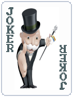

# Monopoly Guy — Balatro Mod

<p align="center">
  
</p>

<h3 align="center">A high-risk, high-reward money Joker for Balatro</h3>

<p align="center">
  <strong>Start rich. Get paid every round. Watch the value disappear.</strong>
</p>

<p align="center">
  
  
  
</p>

> **Monopoly Guy** is a custom Balatro Joker built around a simple idea: **turn money into a temporary resource**. It starts with a huge payout, but every round its value drops by `$5` until it reaches `$0` and destroys itself.

---

## The Joker

**Monopoly Guy** starts with a value of **$100**.

At the end of each round:

1. It gives you its current value in dollars.
2. Its value decreases by **$5**.
3. Once it pays out its final **$5**, its value reaches **$0** and the Joker destroys itself.

### Payout progression

```text
$100 → $95 → $90 → $85 → ... → $10 → $5 → Destroyed
```

The idea is intentionally inspired by the temporary value mechanic of **Ice Cream**, but instead of losing Chips, **Monopoly Guy burns through its cash value**.

---

## Features

- Starts at **$100**.
- Loses **$5** of value after each end-of-round payout.
- Pays out once per round.
- Destroys itself after the `$5` payout.
- It costs 8 of money
- Not compatible with **Blueprint**.
- Not compatible with **Brainstorm**.
- Built as a custom Joker for Balatro using **Steamodded**.

---

## Gif Showcase
<p align="left">
  
</p>

---

## Installation

### Requirements

- **Balatro v1.0.1o or newer**
- **Steamodded v1.0.0-BETA-1501a or newer**

### Installation steps

1. Install **Steamodded** for your Balatro version.
2. Download or clone this repository.
3. Place the mod folder inside your Balatro `Mods` directory.
4. Launch Balatro.
5. Enable the mod through Steamodded if necessary.

### From GitHub

```bash
git clone https://github.com/Rodro-Dev/monopoly-mod.git
```

Then move the resulting `monopoly-mod` folder into your Balatro `Mods` directory.

> **Note:** Installation paths can vary depending on your operating system and Balatro setup.

---

## Development

This mod is written in **Lua** and built for **Steamodded**.

### Current implementation

- Dynamic Joker description showing its current payout.
- End-of-round cash payout.
- `$5` value reduction after each payout.
- Automatic self-destruction at `$0`.
- Explicit incompatibility with Blueprint and Brainstorm.

---

## Contributing

Suggestions, bug reports, balance ideas, and improvements are welcome.

When reporting an issue, please include:

- Your Balatro version.
- Your Steamodded version.
- The mod version/commit you are using.
- A description of what happened.
- A screenshot or log when possible.

---

## License

This project is licensed under the **MIT License**.

See [`LICENSE`](LICENSE) for the full license text.

> **Third-party content:** Balatro, Steamodded, and any third-party assets or trademarks remain the property of their respective owners. This repository's license applies only to material owned by this project to the extent permitted by law.

---

## Credits

**Created by:** [Rodro-Dev](https://github.com/Rodro-Dev)

Special thanks to the Balatro and Steamodded modding communities.

---

## Support the Project

If you enjoy the mod, consider giving the repository a **⭐star** on GitHub. It helps the project get noticed and makes it easier for other players to find.
